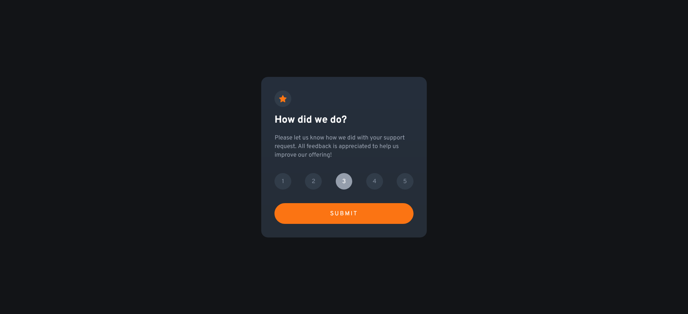

# Frontend Mentor - Interactive rating component solution

This is a solution to the [Interactive rating component challenge on Frontend Mentor](https://www.frontendmentor.io/challenges/interactive-rating-component-koxpeBUmI). Frontend Mentor challenges help you improve your coding skills by building realistic projects.  

## Table of contents

- [Overview](#overview)
  - [The challenge](#the-challenge)
  - [Screenshot](#screenshot)
  - [Links](#links)
- [My process](#my-process)
  - [Built with](#built-with)
  - [What I learned](#what-i-learned)
  - [Continued development](#continued-development)
  - [Useful resources](#useful-resources)
- [Author](#author)
- [Acknowledgments](#acknowledgments)

## Overview

### The challenge

Users should be able to:

- View the optimal layout for the app depending on their device's screen size
- See hover states for all interactive elements on the page
- Select and submit a number rating
- See the "Thank you" card state after submitting a rating

### Screenshot



### Links

- Solution URL: [Github Repo](https://github.com/fritzadelbertus/FEM_Interactive-Rating-Component)
- Live Site URL: [Github Page](https://fritzadelbertus.github.io/FEM_Interactive-Rating-Component/)

## My process

### Built with

- Semantic HTML5 markup
- CSS custom properties
- Flexbox
- Mobile-first workflow
- [Google Fonts](https://fonts.googleapis.com/css2?family=Overpass:wght@400;700&display=swap) - For styles

### What I learned

I think this code is the main part of this challenge for the stylings
```css
input[type="radio"] {
    appearance: none;
}
```
As for the thank you card state. I used switching class which have ```display: none```. I used it to switch from the rating card state to the thank you card state


### Continued development

This challenge opened opportunities for me to learn  customizing pre-defines elements such as radio button. I think I have to learn more on this for next projects.

### Useful resources

- [ModernCSS](https://moderncss.dev/pure-css-custom-styled-radio-buttons/) - This help me create custom radio buttons.
- [Stackoverflow](https://stackoverflow.com/questions/1431726/css-selector-for-a-checked-radio-buttons-label) - Help me customize the label when the radio button is in ```checked``` mode
- [Stackoverflow](https://stackoverflow.com/questions/9618504/how-to-get-the-selected-radio-button-s-value) - Another stack overflow solution that help me target the checked radio button value for the JavaScript code.

## Author

- Website - [Fritz Adelbertus Sitindaon](https://www.furitsu.site)
- Frontend Mentor - [@fritzadelbertus](https://www.frontendmentor.io/profile/fritzadelbertus)

## Acknowledgments

Thank you to FrontEnd Mentor for providing this challenge. The radio button customizing was quite challenging. With this project I also warm up my JavaScript writing.
